 -------------------------------------------------
 * Filename:        beaglebone_black_devkit_mpc5748g_setup.md
 * Author:          Samuel Sarkisian | Mentor: Lini Mestar
 * Creation Date:   June 13, 2021
 * Version:
 * Description:     Document used for AMP purposes.
 * Revisions:
 * Copyright (C) 2021, by the California Institute of Technology. ALL RIGHTS RESERVED. United States Government Sponsorship acknowledged. Any commercial use must be negotiated with the Office of Technology Transfer at the California Institute of Technology.
 * This document may be subject to U.S. export control laws. By accepting this document, the user agrees to comply with all applicable U.S. export laws and regulations. User has the responsibility to obtain export licenses, or other export authority as may be required before exporting such information to foreign countries or providing access to foreign persons.
-------------------------------------------------
# Table of Contents
1. [BeagleBone Black Rev C Setup](#beagleboneblack)
2. [DEVKIT-MPC5748G Rev D Setup](#mpc5748g)

<h1>BeagleBone Black Rev C Setup</h1>
Windows 10

<h2>Step 1 </h2> - Nevigate your self to the link provided below

● https://beagleboard.org/getting-started/

<h2>Step 2</h2> - Install the “Flasher” Debian image from the link below

● https://beagleboard.org/latest-images

<h2>Step 3</h2> - Format your SD Card & place the Debian image from step 2 inside the sd card

<h2>Step 4</h2> - In case you need it install the drivers from link bellow

● First plug in your beaglebone black with usb and then install it from the link provided
below

● https://beagleboard.org/static/START.htm

<h2>Step 5</h2> - Make sure to eject the beaglebone black and put the sd card in the beagle bone

<h2>Step 6</h2> - First hold the button shown below, then plug the usb in so it will be powered on, which
will start the flash process. (This can take anywhere from 30 - 50 minutes).

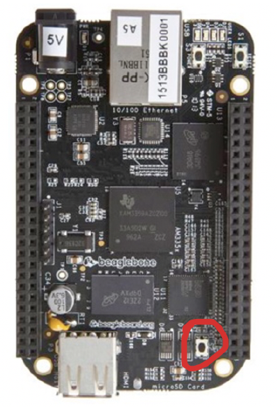

Note: * You will know its done when the 4 LEDs are turned on

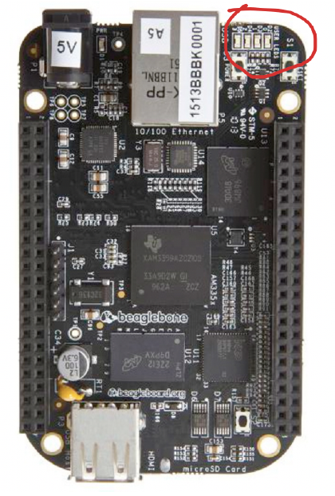

image source: https://beagleboard.org/black

<h2>Step 7</h2> - Eject the board from the computer, take out the usb, and remove the sd card. This way
when you put the usb back and connect it to your computer it wont go through the flash process
again.

<h2>Step 8</h2> - Install PuTTY from link below

● https://www.chiark.greenend.org.uk/~sgtatham/putty/latest.html

<h2>Step 9 </h2>- Create a session, save it, and open it. See below

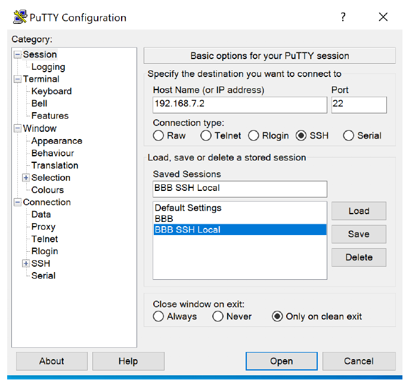

<h2>Step 10 </h2>- login as: debian, password: temppwd

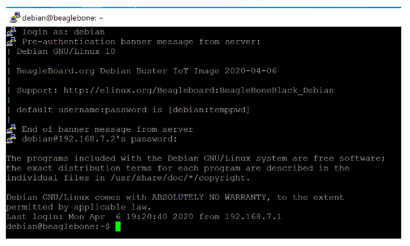

<h2>Step 11</h2> - Create a helloworld program in C language

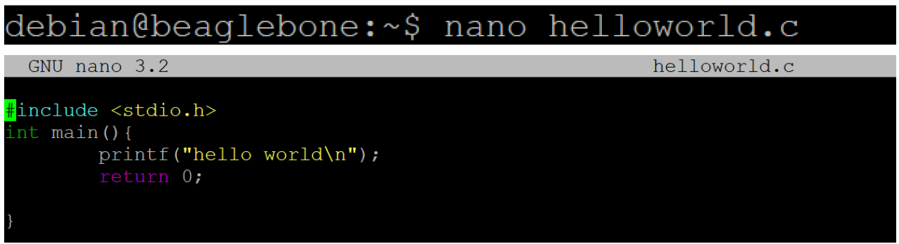

<h2>Step 12</h2> - Compile it using gcc

<h2>Step 13</h2> - run it, which the result is shown below
Note:* You should be able to have access to http://192.168.7.2/ as well, which will open Cloud9
IDE, but the primary focus is the steps above.

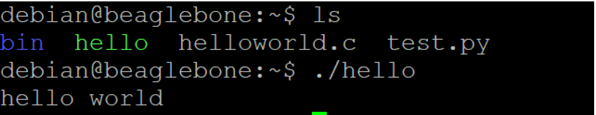

<h2>Step 14(optional)</h2> - Open command prompt and type ssh debian@192.168.7.2

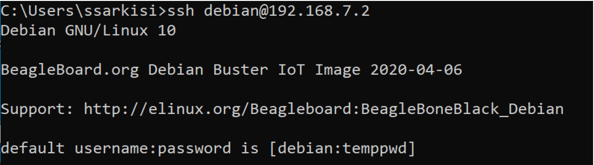

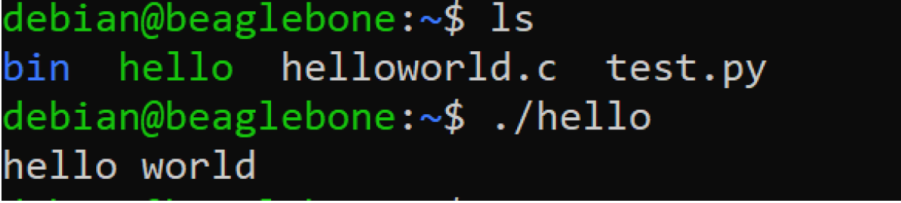

<h3>Congratulations!</h3>

-------------------------------------------------

<h1>DEVKIT-MPC5748G Rev D Setup</h1>
Windows 10

<h2>Step 1</h2> - direct yourself to the link provided below

● https://www.nxp.com/document/guide/get-started-with-the-devkit-mpc5748g:NGS-DEVKIT-MPC5748G

<h2>Step 2 </h2>- Click on “Jump to 2. Get Software” on the top left side.

● Download the Tools and Integrated Development Environment (IDE)

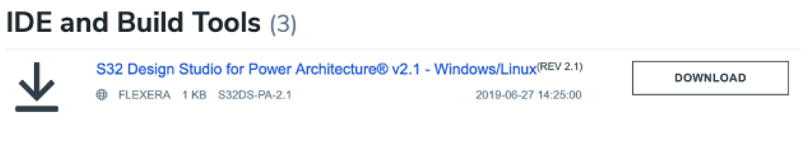

● When you click on it will ask you for account credentials. Go ahead and create an account, and
that will lead you to have access to the next page shown below

● https://nxp.flexnetoperations.com/control/frse/download?agree=Accept&element=10944607
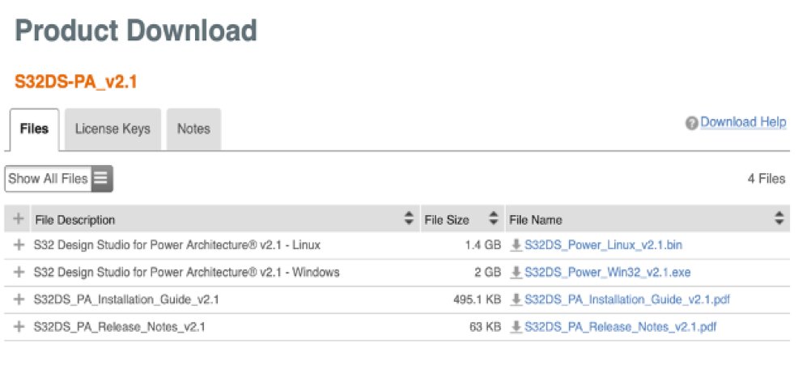

● For Windows 10: Install the S32 Design Studio for Power Architecture v2.1 – Windows
(S32DS_Power_Win32_v2.1.exe), S32_PA_Installation_Guide_v2.1,
S32DS_PA_Realease_Notes_v2.1
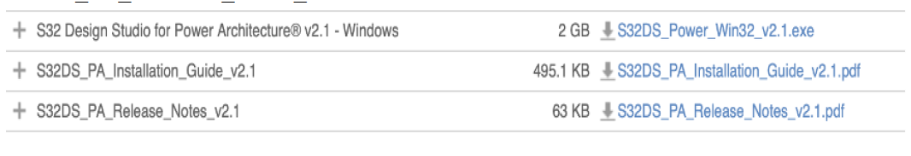

<h2>Step 3</h2>- License Information for S32DS-PA_v2.1

● Activation Code: xxxx-xxxx-xxxx-xxxx

<h2>Step 4</h2> - During the Installation process make sure to get every tool, feature, and settings
installed, allowed, and updated.

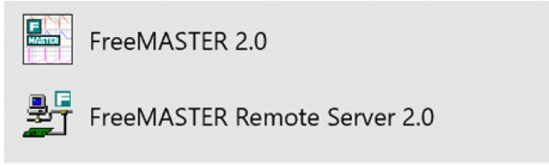

<h2>Step 5</h2>- Direct yourself to this link and see if everything your board has been set up properly

● This will get the User LED2 to start blinking every ½ second.

● https://community.nxp.com/t5/S32-Design-Studio-Knowledge-Base/HOWTO-Create-a-Blinking-
LED-Project-MPC5748G/ta-p/1114912

● Note: there run button doesn’t work, so in order to actually run the program use debug
configuration.

<h2>Step 6 </h2>- Result

● Double Click on the black image, which will lead to a Google Drawing. Double click on
the video, and that will show you a video showing the results of Step 5

<video width="300" height="300" controls>
  <source src="visual_content/MPC5748G.MOV" >
</video>

<h3>Congratulations!</h3>
